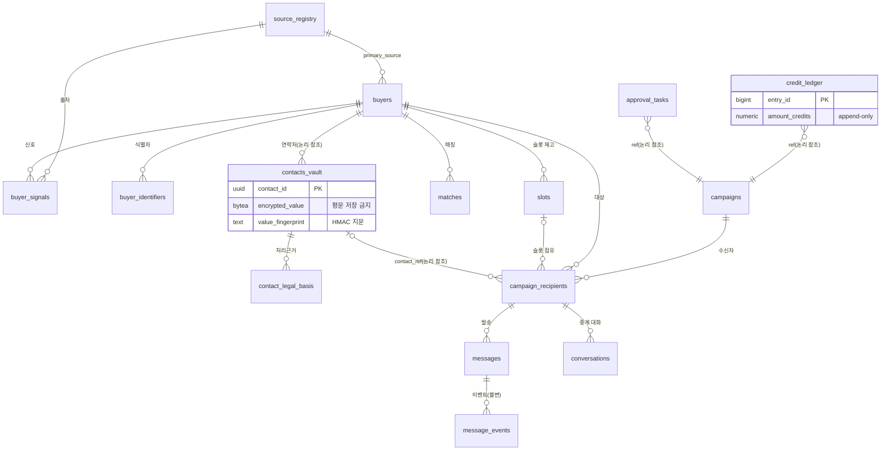

# MarketGate Phase 0 ERD·데이터 사전 (W-001)

> 근거: `docs/ARCHITECTURE.md` §9.1(17테이블)·§2.3(통합 금지·경량 노트)·§4(통제 레이어)·§5(상태·이벤트)·§7(매칭·슬롯)
> 구현: `db/migrations/0001_init_phase0.sql` — 상태 라벨: **문서 확정 기반 구현**
> 원칙: `vault` 스키마 = Contact Vault 권한 분리 경계(단일 Postgres 인스턴스 안에서 스키마+롤로 분리, §2.3).
> **통합 금지 5종(★)**: `contacts_vault`, `contact_legal_basis`, `suppression_entries`, `credit_ledger`, `audit_logs`

## 1. ERD



물리 배치: `core` 스키마 15테이블 + `vault` 스키마 2테이블(★ contacts_vault, contact_legal_basis).
`core`↔`vault` 사이에는 **FK를 걸지 않는다** — 참조는 uuid 값으로만 하고, 접근은 Vault Access Broker 경유(롤 `mg_vault_broker`)로만 한다.

## 2. ENUM 사전

| ENUM | 값 | 근거 |
|---|---|---|
| `source_rights_code` | OPEN_REUSE · INTERNAL_ANALYTICS · OUTREACH_ALLOWED · CUSTOMER_PROVIDED · CONSENTED_INBOUND · CONTRACT_REQUIRED · PROHIBITED · UNKNOWN(기본) | §4.2 8코드 |
| `legal_basis_code` | OPTED_IN · CONTRACT_REQUIRED · LEGITIMATE_INTEREST_REVIEW · PUBLIC_CORPORATE_CONTACT · UNKNOWN_BASIS(기본) · WITHDRAWN · SUPPRESSED | §4.1 7코드 |
| `buyer_verification_status` | DISCOVERED→IDENTIFIED→ACTIVE_SIGNAL→CONTACTABLE→VERIFIED→ENGAGED→QUALIFIED→CONVERTED + SUPPRESSED·DORMANT | §7.1 10종 |
| `campaign_status` | 정상 12단계(DRAFT→…→CLOSED_WON/LOST) + 예외 9종 | §5.1 |
| `message_event_type` | queued · sent · delivered · open · soft_bounce · hard_bounce · complaint · unsubscribe · reply_positive · reply_negative · auto_reply | §5.2 |
| `credit_event_type` | PURCHASE · HOLD · CAPTURE · RESTORE · REFUND · TRIAL_CREDITED · TRIAL_REFUNDED · ADJUSTMENT | §5.2 + PRODUCT §2.0 |
| `suppression_scope` | EMAIL · DOMAIN · COMPANY | §2.1 |
| `contact_channel` | EMAIL · PHONE · FORM · SOCIAL | — |

## 3. 데이터 사전 (17테이블)

### core.source_registry — 출처 권리 (§4.2)
| 컬럼 | 타입 | 설명 |
|---|---|---|
| source_id | text PK | 출처 식별자 (예: `gobiz_inquiry_2024`) |
| rights_code | enum | 8코드, 기본 UNKNOWN(격리) |
| policy | jsonb | 정책 객체 — 기본값 전부 거부(default-deny) |
| contract_ref / acquired_at / valid_until | text/date | 계약·취득·만료 |
| verified_at | timestamptz | 권리 확인 시각 (L001 가드) |

### core.buyers — 바이어 마스터
| 컬럼 | 타입 | 설명 |
|---|---|---|
| buyer_id | uuid PK | |
| display_name / normalized_name | text | 정규화 기업명 (Entity Resolution 키) |
| country_iso3 | char(3) | Country Rule Matrix 관할 판단 입력 |
| verification_status | enum | §7.1 10종 |
| intent_score / score_breakdown | smallint(0~100)/jsonb | §7.1 배점 — **Eligibility와 분리** |
| last_signal_at | timestamptz | 신선도 감점(-10) 판단 |

### core.buyer_identifiers / core.buyer_signals — 식별자·신호
identifiers: `id_type`(domain·duns·registration_no…) + `id_value`, UNIQUE(id_type,id_value,buyer_id).
signals: `signal_type`(bl_import·regulatory_registration·inquiry·exhibition…) + `signal_value` jsonb + lineage(`source_id`,`source_record_id`,`observed_at`,`confidence`,`expires_at`) — §4.3.
§2.3 경량 노트: 초기에는 buyers의 JSONB 컬럼으로 흡수 가능하나 스키마는 전부 수용.

### vault.contacts_vault ★ — 연락처 금고
| 컬럼 | 타입 | 설명 |
|---|---|---|
| contact_id | uuid PK | campaign_recipients.contact_ref가 논리 참조 |
| buyer_id | uuid | FK 미설정(권한 분리) |
| encrypted_value | bytea | KMS 봉투 암호화 — **평문 컬럼 없음** |
| key_id | text | 키 회전 대비 |
| value_fingerprint | text | HMAC 지문 — 중복 방지·수신거부 대조 전용(복원 불가) |

### vault.contact_legal_basis ★ — 처리근거 원장 (§4.1 16필드)
`contact_id`(FK)·`buyer_id`·`source_id`·`collected_at`·`collection_method`·`legal_basis_code`(기본 UNKNOWN_BASIS)·`purpose_code`·`consent_status`·`consent_scope`·`consent_timestamp`·`consent_evidence_uri`(CASL 증빙)·`jurisdiction`·`valid_from`·`valid_until`·`withdrawn_at`·`suppression_reason`

### core.suppression_entries ★ — 수신거부·차단
`scope`(EMAIL/DOMAIN/COMPANY) + `value_fingerprint` UNIQUE 조합. EMAIL은 HMAC 지문으로 대조(평문 불필요).

### core.matches / core.slots — 매칭·슬롯 (§7.4)
matches: `seller_tenant_id`·`buyer_id`·`passport_ref`·`intent_score`·`eligibility_ok`(분리 원칙)·`match_basis`(근거 카드 원자료).
slots: **UNIQUE(buyer_id, product_category_id, period_start)** = 배타성(동일 바이어·품목군·기간 1개사). `consumed_at` = delivered 시 확정 소진(§5.2). 월 2건 상한·쿨다운 30일은 서비스 레이어 + 집계 검증으로 강제(주기 가변 파라미터라 DB 제약 아님).

### core.campaigns / core.campaign_recipients — 캠페인 (§5.1)
campaigns: `status`(21상태 enum)·`template_ref`·`compliance_checklist`(§6.2 6항목 결과)·`approved_by/at`(완료조건 ⑤).
recipients: campaign×buyer UNIQUE, `slot_id`, `contact_ref`(vault 논리 참조).

### core.messages / core.message_events — 발송·이벤트 (§5.2, append-only)
messages: `direction`·`subject`·`body_uri`(본문은 오브젝트 저장소)·`template_version`·`provider_message_id`.
message_events: `event_type`·`occurred_at`·`payload` — **UPDATE/DELETE 트리거 차단**(불변 Event Store).

### core.conversations — Response Relay (§5.3)
`direction`·`relayed_body_uri`·`classification`(spam/auto_reply/interest_±).
**연락처 공개 = `buyer_disclosure_agreed_at`과 `seller_disclosure_agreed_at`이 모두 기록된 경우에만** — 상호동의 원칙을 스키마로 표현.

### core.credit_ledger ★ — 크레딧 원장 (append-only)
`event_type`(HOLD·CAPTURE·RESTORE·REFUND·TRIAL_CREDITED·TRIAL_REFUNDED…)·`amount_credits`(부호 포함)·`ref_type/ref_id`·`created_by`. **잔액 컬럼 없음 — `core.credit_balances` 뷰로만 산출.** UPDATE/DELETE 트리거 차단 + 롤 권한 REVOKE 이중 방어.

### core.approval_tasks — 승인 태스크
`task_type`·`ref_type/ref_id`·`status`·`decided_by/at`. §2.3: campaigns 상태 컬럼으로 흡수 가능(경량 옵션) — 스키마는 유지.

### core.audit_logs ★ — 감사 로그 (append-only)
`actor`·`actor_role`·`action`·`object_type/id`·`before_state`·`after_state`. 완료조건 ⑩.

## 4. 권한 모델 (완료조건 ①② 지원)

| 롤 | core | vault | append-only 테이블 |
|---|---|---|---|
| `mg_app` (API 서버) | SELECT/INSERT/UPDATE | **접근 불가** | INSERT만 (UPDATE/DELETE REVOKE) |
| `mg_vault_broker` (Vault Access Broker 전용) | USAGE | SELECT/INSERT/UPDATE | — |

일반 API가 연락처 평문을 조회할 경로가 DB 권한 차원에서 존재하지 않는다. 복호화는 Broker가 토큰·정책 검증 후 일시 수행(§2.1).

## 5. 적용·검증

```bash
psql -d marketgate -f db/migrations/0001_init_phase0.sql
```

검증 항목(적용 시 확인): ① core 15 + vault 2 = 17테이블 생성 ② credit_ledger UPDATE 시도 → 예외 발생(append-only) ③ slots 동일 (buyer, category, period_start) 중복 INSERT → 유니크 위반 ④ credit_balances 뷰가 원장 합계와 일치.
